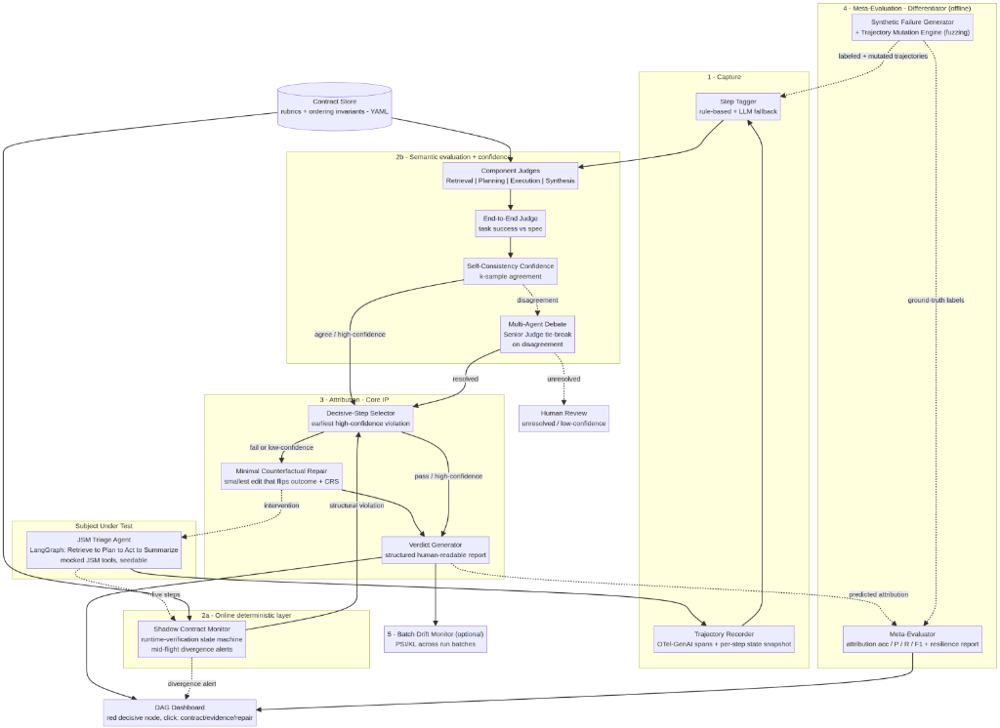
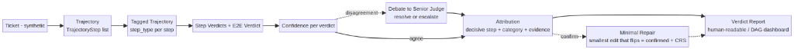
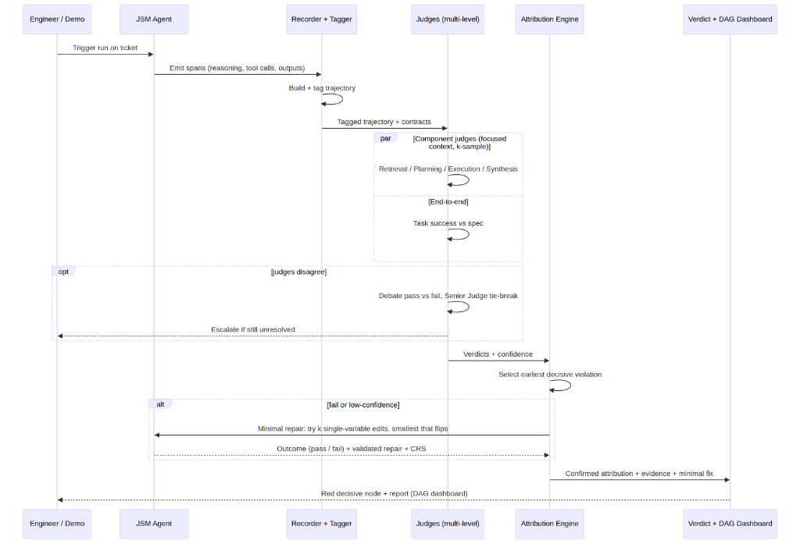

# Culprit

**When your AI agent fails, Culprit names the component, proves it, and tells you how to fix it.**

Culprit is a continuous evaluation system for non-deterministic enterprise AI agents. It captures the full execution trajectory of an agent run, evaluates it at multiple levels with a panel of LLM judges, and — when a run fails — **attributes the failure to the specific component that caused it** (retrieval, planning, tool execution, or synthesis), backs that verdict with **evidence and a confidence score**, and **confirms the attribution by counterfactual replay**. A meta-evaluator then measures how often the attribution is *correct*.

> **AINS Hackathon 2026** · Use Case 1 — Continuous Evaluation for Non-Deterministic AI Agents · **Scenario C — Component-Level Failure Attribution**
> Evaluation target (scope-disciplined): a single **Atlassian Jira Service Management (JSM) ticket-triage agent**.

This repository is the **First Submission**: it demonstrates that the team understands the problem, has committed to a technical direction, and has produced the foundational design, specifications, and project scaffolding the build will execute against. Per the brief, it contains a structured README, the planned project structure, the reusable specifications, and architectural sketches — **a technical foundation and direction, not a finished or yet-functional prototype**. Implementation begins after this submission.

---

## 1. The problem

Enterprise teams deploy agents that don't behave deterministically: the same JSM ticket can produce different tool calls and different routing on two runs. This breaks the usual safety net in three ways:

1. **Pass/fail unit tests don't apply** — there is no exact output to match against.
2. **Silent failures** — an agent can call all the right-*looking* tools, finish with no error, and still misroute a ticket. You find out after the damage is done.
3. **Useless failure signal** — when it does fail, "task failed" tells an engineer *nothing about which step to fix*: was it retrieval, planning, the tool parameters, or the final summary?

Inside Atlassian this gap is explicitly documented: there is no mechanism today to detect that an agent has drifted from its spec, or to attribute a failed run to a component. Culprit fills exactly that gap.

## 2. Why this needs AI (it is the mechanism, not a feature)

Remove the model and Culprit ceases to exist. There is no rule that decides "retrieval returned irrelevant context" or "the final summary asserts a field that was never retrieved" — these are semantic judgments over unstructured reasoning traces and tool I/O. The core mechanism is a **panel of LLM judges evaluating against behavioral contracts**, plus a **meta-evaluator that measures whether those judges are right**. It is not keyword matching, not template filling, and not a wrapper around an existing Atlassian feature.

## 3. Design philosophy: narrow and deep

Automated failure attribution is a **frontier research problem**, not a solved one. On the `Who&When` benchmark the best automated method reaches only ~53.5% at naming the responsible component and ~14.2% at pinpointing the failing step; on `TRAIL` the best frontier model scores ~11% at trace debugging, and accuracy *drops* as the trace gets longer. Two design laws follow directly from that literature and shape every decision below:

1. **Constrain the domain.** General-purpose trace debugging sits at ~11–14%. We win accuracy by *not* being general — one fixed agent, fixed step types, explicit per-step contracts — and we report the resulting accuracy honestly.
2. **Don't judge the whole trace at once.** Because accuracy is anti-correlated with context length, Culprit uses **focused per-step judges** rather than one monolithic whole-trace judge, and **confirms each attribution causally** (replay) instead of trusting a single LLM opinion.

Capture and tracing are commoditized (LangSmith, Phoenix, Braintrust). Culprit's defensible contribution is the stack none of them ship as a product: **multi-level judging → first-decisive-step attribution → counterfactual confirmation → meta-evaluation of the judge.**

## 4. System design

### 4.1 Architecture




The **courtroom metaphor** keeps the whole system intuitive and maps 1:1 to it: behavioral **contracts** are the statute; the **judges** are a panel; **evidence** is cited trajectory fields; the **verdict** is the report; **confidence** is jury agreement; **counterfactual replay** re-enacts the run to confirm the culprit; the **meta-evaluator** is the appeals court that audits the judges.

### 4.2 Components (each has one job)

- **JSM Triage Agent** — the non-deterministic system being evaluated; produces a multi-step trajectory with natural failure points. Kept deliberately simple — it is not the product.
- **Trajectory Recorder** — captures every step (reasoning, tool, parameters, result, latency, status) into an OTel-GenAI-aligned, inspectable `Trajectory`, with a per-step context snapshot. No AI — pure instrumentation.
- **Step Tagger** — labels each step with a type (rule-based on span/tool name, with a cheap-LLM fallback) so judges and attribution can localize.
- **Contract Store** — the behavioral spec: per-step rubrics, the task-success definition (what "correct" means), and **ordering/structural invariants**, as small versioned YAML files. The contracts feed *both* evaluation layers below.
- **Shadow Contract Monitor (advanced, online)** — a deterministic **runtime-verification** state machine compiled from the contracts' ordering invariants (e.g. *a relevant retrieval must precede planning; set_team must precede set_priority; the chosen tool must be capable*). It runs **in parallel** with the live agent and fires a **mid-flight divergence alert** the moment the trajectory violates an invariant — the *online* arm of drift/non-determinism. It checks the **sequence of actions, not the exact text**, so legitimately different valid paths don't trip it.
- **Component Judges** — per-step LLM judges scoring each step against its rubric with **focused context**, returning pass/fail + score + cited evidence. The *semantic* layer: they catch what a state machine can't (irrelevant context, hallucinated grounding).
- **End-to-End Judge** — a task-level success verdict; the second, distinct evaluation level.
- **Self-Consistency Confidence (+ debate escalation)** — k-samples each judge; agreement becomes the confidence. On genuine disagreement, an *advanced* lane runs a short **multi-agent debate** (pass-stance vs fail-stance, adjudicated by a Senior Judge) to resolve it; anything still unresolved escalates to a human. Handles non-determinism *and* cuts the review queue without erasing the uncertainty signal.
- **Decisive-Step Selector** — picks the *earliest* high-confidence violation as the primary suspect (the Who&When decisive-step definition). A structural violation from the Shadow Monitor is a cheap, high-precision early signal here.
- **Minimal Counterfactual Repair** — re-runs the agent from the suspect step and searches for the **smallest single-variable change that flips the outcome to success**, reporting a *validated* repair with a Causal Responsibility Score (CRS). An outcome flip *causally confirms* the attribution; the minimal edit makes the fix precise ("change this one parameter"). Falls back to coarse-correction replay if no small edit flips it.
- **Verdict Generator** — renders the confirmed attribution into a structured, human-readable, actionable report — for every run, including passing ones.
- **Synthetic Failure Generator + Trajectory Mutation Engine** — beyond hand-written faults, a **structure-aware fuzzer** programmatically mutates known-good trajectories (semantic noise, truncated tool results, reordered retrieval blocks, parameter perturbation) to generate a large *labeled* corpus and a **Fuzzing & Resilience Report**. This manufactures the ground truth the Meta-Evaluator needs.
- **Meta-Evaluator** — measures how often Culprit attributes correctly across the labeled + fuzzed corpus (the proof the evaluator works).
- **Batch Drift Monitor (optional)** — flags behavioral distribution shifts *across run batches* over time (PSI/KL) — complementary to the Shadow Monitor's *within-run* divergence.
- **Dashboard (interactive DAG)** — the explainability surface: the trajectory rendered as a directed graph, the decisive node pulsing red, click-to-expand showing the violated contract, evidence, confidence, and the validated minimal repair. A *decoupled* layer that consumes the core's JSON (see §12).

### 4.3 Data flow



### 4.4 Runtime sequence



### 4.5 The attribution algorithm

```text
attribute(trajectory, verdicts, tau):
    if end_to_end(verdicts) == "pass":
        return Attribution(verdict="pass")          # a PASS run still gets a report (E4)

    # earliest high-confidence component violation = decisive suspect (Who&When)
    suspects = [v for v in component_verdicts(verdicts)
                if v.verdict == "fail" and v.confidence >= tau]
    suspects.sort(by=step_index)

    for s in suspects:                              # causal confirmation via MINIMAL repair
        edits = propose_minimal_edits(s, k=4)       # lightweight LLM: one variable each
        for e in sorted(edits, by=edit_size):       # smallest change first
            if replay_from(trajectory, s.step_id, edit=e) == "task_succeeded":
                return Attribution(decisive=s, confirmed=True,
                                   repair=e, crs=causal_responsibility(s), fix=...)
        # fallback: coarse corrected-I/O replay so E3 is never at risk
        if replay_from(trajectory, s.step_id, correction=gold_or_proposed(s)) == "task_succeeded":
            return Attribution(decisive=s, confirmed=True, fix=...)

    return Attribution(decisive=suspects[0], confirmed=False, alternatives=suspects[1:])
```

The **earliest-violation rule** stops Culprit from blaming a downstream symptom when an upstream step poisoned its input; the **counterfactual replay** turns a correlational judgment into a demonstrable causal claim.

### 4.6 How the judges stay honest

LLM judges have documented position, verbosity, and self-enhancement biases (since MT-Bench). Culprit mitigates each cheaply: **rubric-anchored** prompts tied to a written contract, **reference-based** scoring where a gold answer exists, **randomized option order**, and **self-consistency** (k samples → agreement = confidence). Low-confidence verdicts are surfaced for human review rather than asserted — which is also the self-evaluation bonus.

### 4.7 Proving the evaluator works ("judging the judges")

The hardest question a judge can ask is *"how do you know your judge is right?"* — and most teams have no answer. Culprit manufactures its own ground truth: a **fault injector** deterministically corrupts a known-good trajectory into a **labeled** failing one. Running Culprit over many labeled cases yields **attribution accuracy, per-category precision/recall/F1, and step-localization accuracy**, benchmarked against the published ~14% SOTA. This single mechanism wins the Evaluation dimension, earns the self-evaluation bonus, and produces the labels that make any metric possible.

### 4.8 Schemas

Trajectory, evaluation, and attribution are defined as OTel-GenAI-aligned JSON Schemas in [`spec/schemas/`](spec/schemas/); the behavioral contracts live in [`spec/contracts/`](spec/contracts/). The attribution payload — the system's primary output — looks like:

```json
{
  "run_id": "run_2026_0617_017",
  "end_to_end_verdict": "fail",
  "decisive_step_id": "step_00",
  "decisive_step_type": "retrieval",
  "failure_category": "irrelevant_context_retrieved",
  "why": "Retrieval omitted the product_area filter and returned unrelated tickets; the planner then routed the VPN ticket to the wrong team. Every tool call returned ok, so no error fired - a silent failure.",
  "evidence": [
    { "field": "action.arguments.product_area", "expected": "networking", "actual": null },
    { "field": "tool.result", "expected": "VPN / networking tickets", "actual": "printer, email tickets" }
  ],
  "confidence": 0.88,
  "counterfactual": { "performed": true, "result": "task_succeeded", "confirms_attribution": true },
  "recommended_fix": "Populate product_area in the retrieval call and add a relevance re-ranker."
}
```

Full architecture write-up: [`docs/02_architecture.md`](docs/02_architecture.md).

### 4.9 Two-layer evaluation: deterministic monitor + semantic judges (advanced)

Culprit evaluates on two complementary layers, a design borrowed from **runtime verification of LLM agents**, where the field's central lesson is to monitor the *sequence of actions and ordering invariants* rather than exact text — which is exactly what makes a deterministic check compatible with a non-deterministic agent:

- **Deterministic layer — Shadow Contract Monitor.** Each contract's ordering invariants compile into a small state machine (a "digital twin" of intended behavior) that runs *online*, in parallel with the agent. It catches *structural* faults instantly and cheaply — wrong tool order, a missing step, an incapable tool, accessing a field before it was retrieved — and raises a **mid-flight divergence alert** before any LLM judge runs. Because it checks invariants over actions, not text, different valid paths don't trip it.
- **Semantic layer — LLM judges.** These catch what no state machine can express — *was the retrieved context actually relevant? is the summary grounded?* — with focused context and self-consistency confidence.

Two protocol contributions come out of this: the offline **component-attribution event** (§6) and an **online divergence signal** for the same OTel-aligned trace.

To *prove* the whole stack, Culprit doesn't stop at a handful of hand-written faults. A **Trajectory Mutation Engine** (structure-aware fuzzing, in the lineage of classic mutation/coverage fuzzing such as DeepMutation and TensorFuzz, extended to agent trajectories) programmatically mutates known-good trajectories into hundreds of *labeled* failing ones, mapping the agent's exact breaking points and measuring how accurately attribution isolates each injected bug — surfaced as a **Fuzzing & Resilience Report**. Crucially the ground truth comes from the *injection*, not from an LLM-written oracle (LLM-written assertions tend to encode the current, possibly-buggy behavior rather than the intended spec — a known hazard of LLM-generated test oracles).

Full design, mutation-operator catalog, the invariant DSL, and metrics: [`docs/08_adversarial_and_runtime_evaluation.md`](docs/08_adversarial_and_runtime_evaluation.md).

### 4.10 Precision, uncertainty & explainability (advanced)

Three further enhancements, each *deepening an existing component* (no new subsystem):

- **Minimal Counterfactual Repair (CRS).** The attribution engine doesn't just confirm the culprit — it searches for the *smallest single-variable change that flips the outcome to success* and reports it as a validated repair with a Causal Responsibility Score we define. Grounded in the counterfactual-explanation minimality principle (Wachter et al., 2017) and intervention-based causal analysis (Pearl's ladder of causation). Turns "retrieval was wrong" into "change this one parameter and it passes."
- **Multi-agent debate for uncertain verdicts.** When judges genuinely disagree, a short pass-vs-fail debate adjudicated by a Senior Judge resolves it before falling back to human escalation — cutting the review queue while *preserving* the human-in-the-loop for anything still unresolved (Du et al., 2023; ChatEval, 2023; Irving et al., 2018).
- **Interactive DAG dashboard.** The trajectory is rendered as a graph; the decisive node pulses red; clicking it reveals the violated contract, evidence, confidence, and the validated minimal repair — directly serving the 15% Explainability dimension. The dashboard is a *decoupled* layer over the core's JSON (§12).

Full design, mechanisms, honest limitations, and the decoupled-frontend discussion: [`docs/09_precision_uncertainty_explainability.md`](docs/09_precision_uncertainty_explainability.md).

## 5. Acceptance-criteria coverage — 100% addressed by design

Each criterion from the brief is mapped to a component and an implementation strategy. The first submission shows *how* each is satisfied; implementation follows.

| # | Criterion | Priority | Component | Implementation strategy |
|---|---|---|---|---|
| E1 | Trajectory capture works | **Must** | Recorder | LangGraph callbacks emit OTel-GenAI spans → typed `Trajectory` in SQLite/JSON |
| E2 | Multi-level evaluation | **Must** | Judges + contracts | Per-step component judges (focused context) + an end-to-end judge; rubric-anchored, no exact-match |
| E3 | Failure attribution | **Must** | Attribution Engine | Earliest high-confidence violation = decisive step, confirmed by **minimal counterfactual repair** (smallest change that flips the outcome → validated fix + CRS) |
| E4 | Human-readable verdict | **Must** | Verdict Generator | Template renders the Attribution into a report — for every run incl. PASS |
| E5 | Drift detection | Should | Shadow Monitor + Batch Drift Monitor | *Online* within-run divergence alerts (runtime-verification state machine) **and** *batch* PSI/KL across run batches — two timescales |
| E6 | Non-determinism addressed | Should | Self-Consistency Confidence + Shadow Monitor | k-sample judges (agreement = confidence) for semantics, with **debate** resolving genuine disagreements before human escalation; invariant-over-actions checking for structure — both robust to different valid paths; documented |
| E7 | Evaluation of the evaluator | Should | Meta-Evaluator + Mutation Engine | Inject + **fuzz** labeled faults (hundreds of variations) → attribution accuracy / P / R / F1 / step-localization + resilience report |
| G1 | AI is the mechanism | Gating | whole system | Judging + attribution are irreducibly semantic |
| G2 | Actionable structured output | Gating | Verdict Generator | Evidence + confidence + recommended fix |
| G3 | Beyond retrieval | Gating | Judges + Attribution | Multi-level classification + attribution + drift |
| G4 | Explainability | Gating | Verdict + interactive DAG dashboard | Cited evidence + confidence + decision trace + a red decisive node with click-to-expand contract/evidence/validated repair |
| G5 | Metric on a test set | Gating | Meta-Evaluator | Metrics on a synthetic labeled set |
| NF1 | Responsiveness | Non-func | (design) | Latency budget + gating (deep path only on failure) |
| NF2 | Reliability | Non-func | (design) | Degraded modes: judge failure → low-confidence fallback; missing fields flagged, no crash |
| NF3 | Scalability mindset | Non-func | (design) | Async judge pool; offline meta-eval; gating keeps cost ∝ failure-rate |

Full traceability with intended demo evidence: [`docs/03_acceptance_criteria_traceability.md`](docs/03_acceptance_criteria_traceability.md).

## 6. Bonus points — all four targeted

| Bonus (PDF §5.2) | How Culprit earns it | Where |
|---|---|---|
| **Protocol gap addressed & documented** | OTel GenAI standardizes `invoke_agent` / `execute_tool` spans and an evaluation event, but defines **no component-attribution event** and **no online divergence event**. Culprit specifies both and aligns them to OTel. | [`docs/07_protocol_gap_otel.md`](docs/07_protocol_gap_otel.md), `spec/schemas/` |
| **Self-evaluation** | Self-consistency confidence, **multi-agent debate** to resolve uncertain verdicts, and the meta-evaluator (proven on a fuzzed, labeled corpus) — together they surface and resolve low-confidence verdicts while still escalating the genuinely ambiguous ones to humans. | §4.6, §4.7, §4.9, §4.10 |
| **Open contribution** | The failure taxonomy, contract schema, and meta-eval design are published as reusable artifacts under MIT. | [`spec/`](spec/), [`docs/06_failure_taxonomy.md`](docs/06_failure_taxonomy.md) |
| **Real enterprise validation** | Build-phase commitment: recruit ≥1 enterprise engineer / AI-platform owner to run the prototype on their own JSM-style tickets and log structured feedback on attribution usefulness. | Build phase |

## 7. Gap analysis vs. the state of the art

Capture and tracing are commoditized; Culprit is positioned squarely on what these tools *don't* ship.

| Tool | Strength | What it does NOT give you |
|---|---|---|
| LangSmith | Tracing, datasets, LLM-as-judge scoring | First-decisive-step **attribution**; counterfactual confirmation; meta-eval of the judge |
| Arize Phoenix | OSS tracing, span-level eval | Causal/counterfactual attribution; "which component caused it" as a verdict |
| Braintrust | Scorers, eval datasets, regression tracking | Component attribution; replay-based confirmation |
| AgentOps | Session/step tracking, cost/latency | Principled multi-level eval + attribution engine |
| OpenTelemetry GenAI | Standard spans + an evaluation event | A component-**attribution** event (the gap Culprit fills) |
| Datadog LLM Obs / WhyLabs | Monitoring, drift at scale | Evidence-backed root-cause + eval-of-evaluator |

## 8. Failure modes of the design (and how we handle them)

Naming where the system can break is part of the engineering, not an afterthought.

| Failure mode | Why it happens | Mitigation |
|---|---|---|
| The judge is simply wrong | LLM evaluation is noisy/biased | Meta-eval **quantifies** the error; rubric anchoring + self-consistency reduce it |
| Over-attribution (everything "fails") | Contracts too strict | Calibrate threshold τ on the synthetic set; report calibration |
| Cascading false blame | A downstream step fails only because an upstream step poisoned its input | Earliest-decisive-violation rule + counterfactual confirmation |
| Symptom ≠ root cause | Correlation-only judging | Counterfactual replay: fixing the suspect must flip the outcome |
| Cost / latency blowup | N judges × k samples on every run | Gate the deep path on `fail OR confidence<τ`; cheap model for tagging; the Shadow Monitor is a cheap deterministic pre-filter |
| Shadow Monitor false alerts | Invariants too strict; a valid alternative path looks like divergence | Invariants are deliberately *minimal and structural* (ordering/capability), never exact-path; alerts are signals into attribution, not hard blocks; tuned on the fuzzed corpus |
| Shadow Monitor blind spots | Semantic faults can't be expressed as invariants | By design it only covers structural categories; the LLM judges own the semantic ones — the two layers are complementary, not redundant |
| Debate converges confidently-wrong | Persuasive-but-wrong consensus / sycophancy in LLM debate | Debate never erases the uncertainty signal: unresolved or low-confidence debates still escalate to a human; debate triggers only on genuine disagreement |
| Minimal repair doesn't generalize | A small edit that flips *this* run may not fix all tickets | Reported as a *validated local* fix with a CRS, not a global patch; falls back to coarse-correction replay if no minimal edit flips it |
| Demo flakiness | A non-deterministic agent live | Run on recorded fixtures / seeded replay (and frame determinism as a feature) |

## 9. Non-functional design

- **Responsiveness (NF1).** Indicative budget: a passing run ≈ 10–14 s (tagging < 1 s, parallel k-sampled component judges ≈ 6–10 s, end-to-end judge ≈ 2–3 s); a failing run adds ≈ 8–12 s for counterfactual replay. **Gating** runs the expensive deep path only on failed/low-confidence runs.
- **Reliability (NF2).** A judge timeout retries once, then emits `unknown` at confidence 0 and flags for review — the pipeline never crashes. Missing/empty ticket fields are treated as signal (a missing `component` is itself attributable), not a crash. A failed replay falls back to correlation-based attribution so the E3 Must still holds.
- **Scalability (NF3).** Judges are independent → an async pool scales horizontally. Gating means deep-path cost scales with the *failure rate*, not the run rate, so it grows sub-linearly at 10× volume. Meta-eval runs offline/batch, decoupled from the online path. Storage moves SQLite → Postgres; trajectories are append-only, partitioned by day.

Details: [`docs/05_evaluation_plan.md`](docs/05_evaluation_plan.md).

## 10. What this repository contains

A foundation, not a build:

- **This README** — the system design and how every criterion is met.
- **Concept presentation** — [`docs/01_concept.md`](docs/01_concept.md) (≤10 pages): problem, solution, target users, core AI mechanism, value proposition.
- **Architecture sketches** — [`docs/02_architecture.md`](docs/02_architecture.md): component, data-flow, and sequence diagrams, the attribution algorithm, and the JSON schemas.
- **Reusable specifications** (the open-contribution artifacts) — `spec/schemas/` (OTel-aligned JSON schemas) and `spec/contracts/` (per-step behavioral contracts). These are design specifications, not running code.
- **Supporting design docs** — data description, evaluation plan, failure taxonomy, the OTel protocol-gap note, and architecture decision records (`docs/adr/`).
- **A planned project structure** — the `src/culprit/` module layout below documents where each component will live during the build phase. No implementation code ships in this submission.

## 11. Planned repository layout

```
culprit/
├── README.md                     # you are here
├── docs/
│   ├── 01_concept.md             # concept presentation (<=10 pages)
│   ├── 02_architecture.md        # components, data flow, sequence diagram, schemas (Mermaid)
│   ├── 03_acceptance_criteria_traceability.md
│   ├── 04_data_description.md     # synthetic data: sources, formats, key fields, quality, sensitivity
│   ├── 05_evaluation_plan.md      # metrics, test protocol, non-determinism, latency, reliability, 10x
│   ├── 06_failure_taxonomy.md     # OPEN CONTRIBUTION: the failure taxonomy
│   ├── 07_protocol_gap_otel.md    # BONUS: the OTel GenAI attribution-event gap
│   ├── 08_adversarial_and_runtime_evaluation.md  # ADVANCED: trajectory fuzzing + shadow monitor
│   └── adr/                       # architecture decision records
├── spec/                          # OPEN CONTRIBUTION (reusable specifications)
│   ├── schemas/                   # trajectory / evaluation / attribution JSON Schemas (OTel-aligned)
│   ├── contracts/                 # per-step behavioral contracts (YAML) - rubrics
│   └── invariants/                # ordering/structural invariants for the Shadow Monitor (YAML)
├── src/culprit/                   # initial structure — placeholders for the build phase
│   ├── agent/                     # subject under test: JSM triage agent
│   ├── recorder/                  # E1 capture (OTel-aligned)
│   ├── tagger/                    # step typing
│   ├── monitor/                   # Shadow Contract Monitor (runtime-verification state machine)
│   ├── evaluation/                # E2 judges + contracts + E6 confidence
│   ├── attribution/               # E3 decisive-step + counterfactual replay
│   ├── verdict/                   # E4 human-readable report
│   ├── drift/                     # E5 batch drift monitor
│   └── meta_eval/                 # E7 fault injection + mutation engine (fuzzing) + metrics
├── data/synthetic/                # sample tickets + trajectories (illustrative fixtures)
├── data/outputs/                  # sample verdict (target output shape)
└── ui/                            # dashboard plan (explainability layer)
```

## 12. Technical direction & stack (chosen, justified)

- **Orchestration:** LangGraph — an explicit node/edge graph makes step boundaries (and therefore step-level attribution) first-class.
- **Subject agent:** a 4-node JSM triage graph — `Retrieve similar tickets → Plan (classify + choose actions) → Act (set team/priority via mocked JSM tools) → Synthesize summary`. Mocked tools keep runs deterministic and side-effect-free (no live Jira writes).
- **Judges:** LLM-as-judge, rubric-anchored and reference-based, with randomized option order and self-consistency sampling.
- **Capture:** framework callbacks emitting OpenTelemetry GenAI-aligned spans; a thin MCP logging shim is a stretch goal.
- **Storage:** SQLite for runs (Postgres at scale).
- **UI (decoupled):** an interactive **DAG dashboard** (timeline → graph; red decisive node; click → contract / evidence / confidence / validated repair; meta-eval + drift tabs), built with **Streamlit + a graph component** (`streamlit-agraph` / `pyvis` / Plotly). It is a presentation layer over the core's OTel-aligned JSON — the evaluation engine never depends on the web framework, so the UI is swappable without touching the core.

## 13. Research foundation

- **Who&When** — Zhang et al., ICML 2025 (arXiv:2505.00212). Formalizes automated failure attribution; defines the **decisive step** = the earliest mistake whose correction flips failure→success. Adopted directly.
- **TRAIL** — Patronus AI, 2025 (arXiv:2505.08638). Error taxonomy; accuracy anti-correlated with context length → justifies focused per-step judges.
- **Agent-as-a-Judge** — Zhuge et al., 2024 (arXiv:2410.10934). Step-level feedback beats outcome-only → justifies multi-level evaluation.
- **MAST** — Cemri et al., NeurIPS 2025 (arXiv:2503.13657). 14 empirical failure modes; many failures stem from system design, not model limits → attribution-then-fix is the right loop.
- **Causal / counterfactual analysis** — intervention beats correlation (Pearl's ladder of causation; counterfactual reasoning) → backs the replay/repair step.
- **Self-Consistency** — Wang et al., 2022; **G-Eval** — Liu et al., 2023; **LLM-as-judge biases** — Zheng et al., 2023 (MT-Bench).
- **OpenTelemetry GenAI semantic conventions** (v1.4x) — the interoperable schema baseline and the documented gap Culprit fills.

**Runtime verification of agents (grounds the Shadow Contract Monitor).** Runtime verification / runtime monitoring is a well-established formal-methods discipline — checking an execution against temporal-safety properties (LTL-style ordering and capability invariants) as it runs. The transferable lesson for LLM agents, and the basis for handling non-determinism structurally, is to monitor the **action sequence and ordering invariants independent of the exact textual output**, so that legitimately different valid paths don't trip the monitor while genuine structural violations do. (Applying classical RV/temporal-monitoring techniques to LLM-agent trajectories is an active, emerging research direction.)

**Adversarial testing (grounds the Trajectory Mutation Engine).** Classic mutation and coverage-guided fuzzing of ML systems — DeepMutation (Ma et al., ISSRE 2018) and TensorFuzz (Odena et al., ICML 2019) — establish the mutation-testing and fuzzing techniques we adapt. Culprit's contribution is extending **structure-aware (grammar-guided) mutation** to agent *trajectories*, keeping every mutated trajectory schema-valid while injecting a known, labeled fault.

**Minimal counterfactual repair (grounds the CRS upgrade).** The minimality principle — the smallest change to the input that flips the outcome — comes from counterfactual explanations (Wachter, Mittelstadt & Russell, 2017). Combined with intervention-based causal reasoning (Pearl), it motivates our **Causal Responsibility Score**: re-execute from the suspect step, search for the smallest single-variable edit that flips failure→success, and report it as a re-execution-validated repair. (We define the CRS for this system; it is inspired by, not taken from, a specific prior implementation.)

**Multi-agent debate (grounds the uncertainty-resolution lane).** Multiagent debate (Du et al., arXiv:2305.14325, 2023); ChatEval (Chan et al., arXiv:2308.07201, 2023) for debate-based LLM-as-judge evaluation; AI safety via debate (Irving, Christiano & Amodei, arXiv:1805.00899, 2018).

## 14. Status & limitations

This is the **first submission**: technical direction and design, with architectural sketches and reusable specifications — not yet functional code. The implementation (subject agent, recorder, judges, attribution, counterfactual replay, drift, meta-eval, dashboard) is the work of the build phase. Honest open risks: counterfactual replay is the highest-risk component and is designed to **degrade gracefully** to correlation-based attribution; reported accuracy is on a **deliberately constrained** domain, which is the point of the scoping decision (see [`docs/adr/0002-scope-to-jsm-triage-agent.md`](docs/adr/0002-scope-to-jsm-triage-agent.md)).

**License:** MIT (see [`LICENSE`](LICENSE)).
